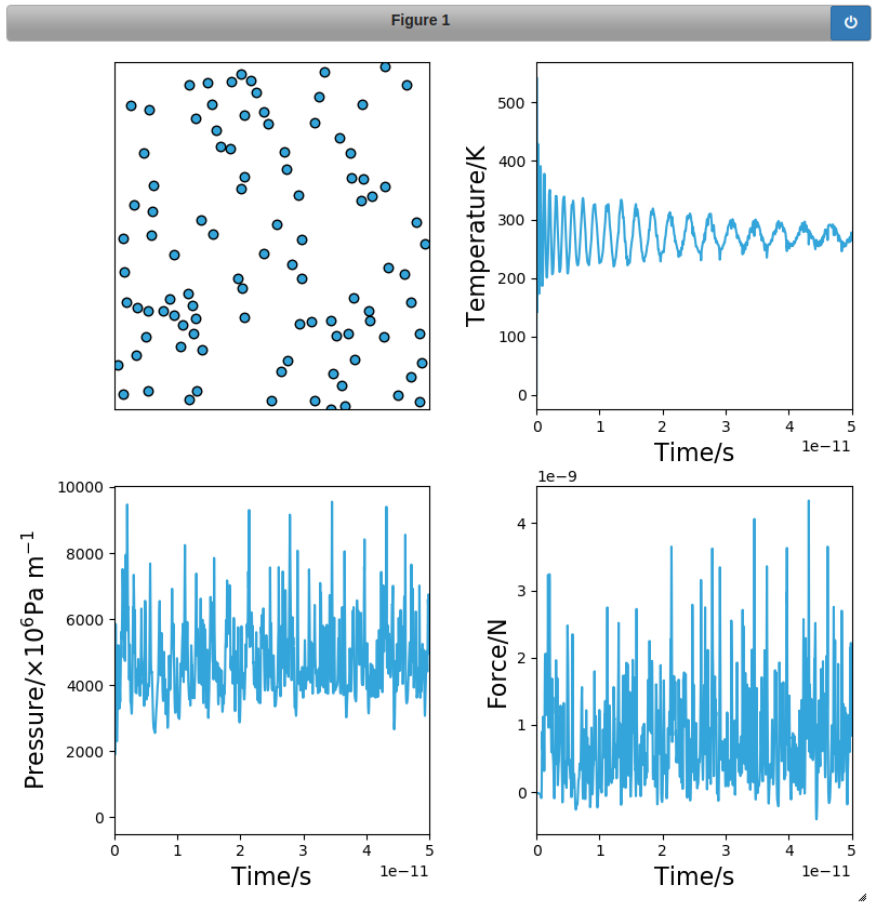

# Summary

pylj is an educational software designed to introduce students to classical simulation using a Lennard-Jones potential model.[@LENNARD-JONES] Currently, pylj is capable of performing both molecular dynamics (NVE and NVT ensembles) and Monte-Carlo (NVT ensemble) simulations, for a two dimensional argon gas system. Written in Python (with Cythonic pairwise functions), visualisation occurs through a Jupyter notebook,[@KLUYVER] making use of the matplotlib library (an example of the Interactions visualisation environment is shown below).[@HUNTER]  This allows for easy deployment within a computational laboratory setting and immediate student interaction without an explaination of the command line. Example notebooks that show how pylj can be used to simulate both molecular dynamics and Monte-Carlo are available from the GitHub repository, although a large variety of possible applications are possible.

*Figure 1. An example of the Interactions sampling class during a molecular dynamics simulation. [@FIGURE1]*

The `md` module currently allows a Velocity-Verlet [@FRENKEL200263] NVE simulation, which can be adapted to NVT by allowing the thermostating via velocity rescaling. The `mc` module allows a typical NVT Metropolis Monte-Carlo simulation[@FRENKEL200223], however there is scope for future development of μVT, Grand-Canonical simulations.

The latest release of the software can be installed via pip, or from source at https://github.com/arm61/pylj. Full documentation can be found at https://pylj.readthedocs.io.

# Statement of Need

As computational science becomes more and more important in the training of undergraduate chemistry and physics students, there is a larger need for easy to use, open-source, sustainable tools that enable student interaction with classical simulation. pylj allows this by offering a simple library of functions from which students can build their own molecular dynamics or Monte-Carlo simulation and easy visualisation, leveraging matplotlib and the Jupyter notebook framework. In addition to use in the introduction of the simulation itself, pylj can also be used to discuss material properties showing how they may be probed using simulation. An example of this application, is the use of pylj to investigate the ideal gas law and the deviation from it at high particle densities can be found in the [examples](https://github.com/arm61/pylj/tree/master/examples) folder on the Github repository. pylj enables easy student interaction with these commonplace simulation methods in a fast and open-source way, while offering educators tools to build custom visualisation environments allowing attention to be drawn to areas of specific focus for a given application.

# Acknowledgements

A.R.M. is grateful to the university of Bath and Diamond
Light Source for co-funding a studentship (Studentship Number
STU0149). B.J.M. acknowledges support from the Royal Society (Grant No. UF130329).

# References
